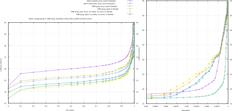

This is the excellent OpenPGM by [Steven McCoy](https://github.com/steve-o).

Here are the results of some latency experiments with this branch (rai) of
OpenPGM and [Aeron](https://github.com/real-logic/aeron).  The graph represents
the outputs of the Aeron
[cping/cpong](https://github.com/raitechnology/aeron/blob/master/aeron-samples/src/main/c/cping.c)
and a PGM ping [test/ping.cpp](test/ping.cpp).

The commands were run like this, with the
[HdrHistogram](https://github.com/raitechnology/HdrHistogram_c) output captured
and gnuplotted.

```console
# on Host "tracy" (AMD 3970X)
$ export AERON_THREADING_MODE=SHARED
$ export AERON_SHARED_IDLE_STRATEGY=spin
$ aeronmd &
$ cping -C 'aeron:udp?endpoint=224.4.4.3:7444|interface=192.168.25.22' -c 'aeron:udp?endpoint=224.4.4.5:7445|interface=192.168.25.28' -w 1000 -m 10000000

# on Host "deedee" (Intel i9-10980XE)
$ export AERON_THREADING_MODE=SHARED
$ export AERON_SHARED_IDLE_STRATEGY=spin
$ aeronmd &
$ cpong -C 'aeron:udp?endpoint=224.4.4.3:7444|interface=192.168.25.21' -c 'aeron:udp?endpoint=224.4.4.5:7445|interface=192.168.25.21'

# on Host "tracy" (AMD 3970X)
# taskset -c 1 pingpgm -b -c 1000000 -n '192.168.25.0;224.4.4.5;224.4.4.3'

# on Host "deedee" (Intel i9-10980XE)
$ taskset -c 1 pingpgm -b -r -n '192.168.25.0;224.4.4.3;224.4.4.5'
```



There are two libraries created for the ping program.  The libopenpgm library
is a multithreaded version, capable of splitting the send and recv sides
into separate threads.

The libopenpgm_st library is a single threaded version, without locks and
notification events.  This must also be run async, since blocking on a recv
would corrupt the protocol.  When publishing on the network the thread is also
maintaining the reliability of the stream through a state machine of timed
events.
